# 🛡️ Create a Virtual Machine & Add Azure Resource Locks

## 📖 Overview
This lab demonstrates how to:
- Create a **Virtual Machine (VM)** in Azure.
- Apply **resource locks** to prevent accidental changes or deletions.
- Understand the difference between **Delete locks** and **Read-only locks**.

Resource locks are a simple but effective way to protect cloud resources from unintentional modifications.

---

## 🚀 Steps

### 1. Create a Virtual Machine
1. In the **Azure Portal**, select **Create a resource** → **Virtual Machine**.
2. Create a new **Resource Group** named: `NordicVault-Resources`.
3. Configure the VM:
   - **Name**: `NordicVault-VM`
   - **Region**: Select your preferred location
   - **Image**: Ubuntu Server 20.04 LTS (Gen2)
   - **Size**: B2s
   - **Username**: `NordicUser`
   - **Authentication**: Strong password
   - **Disk**: Standard SSD
   - **Security Type**: Trusted Launch
4. Review and create the VM.

---

### 2. Add a Delete Lock to the Virtual Machine
1. Navigate to the newly created VM.
2. In the left menu, go to **Settings → Locks**.
3. Click **+ Add**:
   - **Name**: `VMDeleteLock`
   - **Lock Type**: Delete
4. Save the lock.

Result: The VM cannot be deleted unless the lock is removed.

---

### 3. Add a Read-Only Lock to the Resource Group
1. Go to the **Resource Group** `NordicVault-Resources`.
2. Open **Settings → Locks**.
3. Add a new lock:
   - **Name**: `RGReadOnly`
   - **Lock Type**: Read-only
4. Save the lock.

Result: All resources in the group are viewable but cannot be modified.

---

### 4. Clean-Up (Optional)
1. Attempt to delete the VM → operation fails due to the lock.
2. Remove both locks (`VMDeleteLock`, `RGReadOnly`).
3. Delete the VM and Resource Group.

---

## 📊 Summary Diagram

```mermaid
flowchart TD
    A[Virtual Machine Created] --> B[Apply Delete Lock to VM]
    A --> C[Apply Read-only Lock to Resource Group]
    B --> D[Test Delete VM → Blocked]
    C --> E[Test Modify Group → Blocked]
    D --> F[Remove Locks for Cleanup]
    E --> F
```

---

## 📝 Key Takeaways
- **Delete Lock**: Prevents resource deletion.  
- **Read-only Lock**: Prevents changes but allows viewing.  
- Locks must be **removed** before resources can be modified or deleted.  
- Resource locks provide a simple way to protect critical assets in Azure.

---

✒️ *Created by Muhammad Naveed Ishaque (Eks2)*  
*Technical Writer | AI & SaaS Documentation Specialist*  
